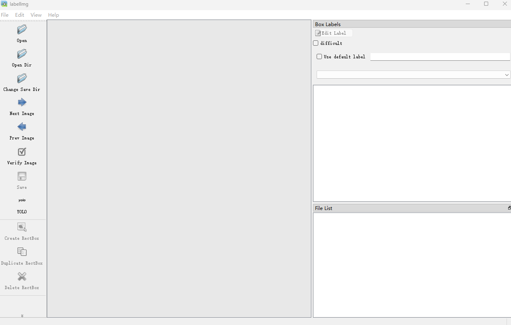
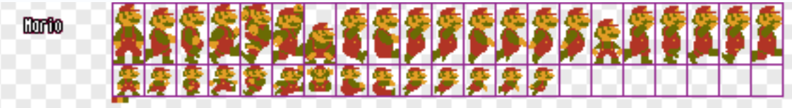
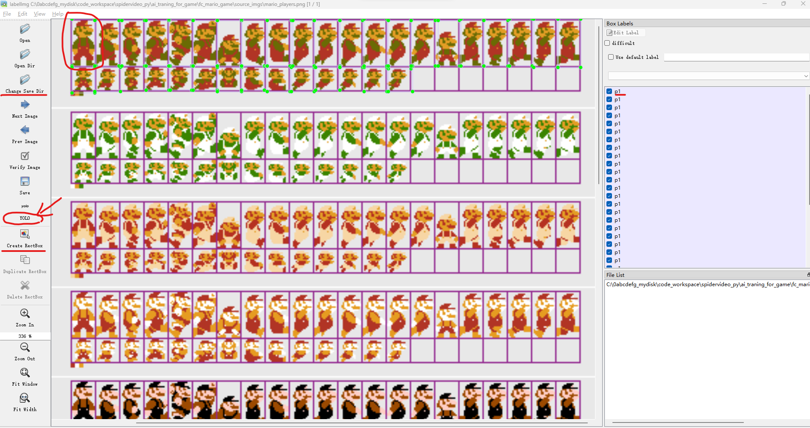

# 如何使用 YOLO V8 训练出自己的模型数据，并运用到目标检测中？
## * - 本案例以识别 "FC经典游戏 超级玛丽" 中的 P1 为目标
## * -- 最终实现效果是能够通过 YOLO V8 识别出 FC模拟器中超级玛丽游戏中的 P1 角色

### 我的笔记文章
* [YOLO V8 模型训练和目标检测初学者笔记](https://juejin.cn/post/7344573755643101238)
* [Yolo V8 模型训练初学者笔记 -- 目标检测应用到实际游戏程序中](https://juejin.cn/post/7354007029239562290)
* [Yolo V8 模型训练初学者笔记 -- win11成功调用GPU(RTX4060)进行模型训练](https://juejin.cn/post/7354398676645150757)

## 目标实现思路
- 收集训练模型所需的图片素材
- 利用 labelimg 标注图片素材（保存输出符合 YOLOV8 模型结构要求的数据文件）
- 利用 YOLO V8 训练模型（生成数据模型文件）
- 通过 YOLO V8 读取训练好的模型文件进行目标检测

### 本人系统及配置
- Windows 11
- GPU: NVIDIA RTX 4060 8G （利用 GPU 训练模型数据）

### 环境准备
- 安装 Anaconda
- 本机安装 python，并配置环境变量
- ---（这里不作详述，因为网上教程很多，本篇重点是记录训练和检测目标的过程）---

### Anaconda 镜像源切换
- 要将Anaconda的镜像源修改为国内的镜像源，您可以按照以下步骤操作：
- (打开 Anaconda Prompt 终端)
```shell
# 使用以下命令移除默认的channels
conda config --remove channels defaults
# 添加国内镜像源，例如清华大学镜像源
conda config --add channels https://mirrors.tuna.tsinghua.edu.cn/anaconda/pkgs/main/
# 设置show_channel_urls为true，这样conda在安装过程中会显示channel的URL
conda config --set show_channel_urls true
```

### 安装 labelimg
  - （安装说明：由于 labelimg 对 python 版本有要求，我目前安装的 labelimg 需要基于 python 3.9 版本，但我宿主机环境里装的是 python 3.10，为了不影响宿主机环境，我选择在 Anaconda 虚拟环境中安装并使用 labelimg）
- - 开始安装：
  - 打开 Anaconda Prompt 终端，创建 python 3.9 的虚拟环境，并激活
```shell
# 创建名为 python39 的虚拟环境
conda create -n python39 python=3.9.16
# 激活已经创建的环境
conda activate python39
# pip install 工具包报错 ssl 有关内容，则设置show_channel_urls为true 即可
conda config --set show_channel_urls true
```
  - 安装 labelimg：
```
# 记录在 Anaconda Prompt 终端窗口中依次输入下列代码，这些是 labelimg 依赖的第三方库
pip install PyQt5
pip install pyqt5-tools
pip install lxml
# 然后安装 labelimg
pip install labelimg
```
  - 安装完成后，在 Anaconda Prompt 终端窗口中输入 labelimg，回车，即可打开 labelimg 软件
```
labelimg
```


### 操作开始！！！
### 1 - 项目目录准备
- 创建一个文件夹，比如我的项目文件夹名为：fc_mario_game

### 2 - 收集训练模型所需的图片素材
 - 收集素材图片的方式有很多（爬虫、自己截图、网上找之类的），这份案例仅仅是初步学习，为的就是能够成功搞出一份自定义训练模型且能够成功使用，所以尽量简单些，用最简单的方式收集了一些素材图片（网上找的素材包）
 
  - 把收集的素材图片，放到项目文件夹里，比如我这样
  ```
  -- fc_mario_game
     |__ source_imgs
         |__ mario_players.png
  ```

### 3 - 利用 labelimg 对图片进行打标签
#### （标签打好之后，保存输出符合 YOLOV8 模型结构要求的数据文件）
- 打标签的目的是为了，在训练模型的时候，让 YOLO V8 对相应的一系列图片做标记，从而让 YOLO V8 在目标检测的时候，识别出正确的目标

- 3.1 - 在 Anaconda Prompt 终端的 python 3.9 虚拟环境中通过 labelimg 指令启动软件

  - 打开 labelimg 软件后，点击“Open Dir”按钮，选择刚才准备好的素材图片文件夹，即 source_imgs/
  - 【重点】：把左侧操作列中的模式改成 YOLO，即上图中用箭头圈出来的位置，默认是别的格式的，鼠标点击一下就会切换到 YOLO 模式，这样最后保存输出的文件就是满足 YOLO V8 模型结构要求的数据文件了（即 txt 文件）
  - 再选择 Change save dir 按钮，选择我们希望输出文件的保存位置，比如我这样：
```
  -- fc_mario_game
     |__ source_imgs
         |__ mario_players.png
     |__ labelimg_output （我希望输出文件的保存位置）
```
  - 然后点击“Create rect box”按钮，在弹出的窗口中，选择“Create new shape”，开始对对应的区域画格子，画好格子会让你为标签命名，比如上图中我都命名为 p1 表示这是player1（该案例目的只是为了识别出人物就行，如果往复杂了想，不同的一系列动作都要命名为不同的标签名称，这样就能识别得更精确，比如死亡状态的超级玛丽，当然我们这案例里不需要这么复杂，先感受明白整个训练过程即可）
  - 最后格子都画完了，点击“Save”按钮，保存好标签文件，就会在目录里看到输出的标签数据文件了，比如我这样：
```
└─fc_mario_game
    ├─ source_imgs
        │ mario_players.png
    ├─ labelimg_output （输出文件的保存位置）
        │ mario_players.txt （记录了相应图片上画格子的坐标数据和相应的标签索引数据）
        │ classes.txt (记录了所有的标签命名)
```

### 4 - 代码开始！！！ -- 训练模型
#### 4.1 -- 目录准备
* 【注】：yolov8n.pt 这个文件是官方提供的，在我们调用 YOLO('yolov8n.pt') 这行代码的时候，若目录下没有这个文件，会自动去下载，所以不用提前下载好
* 下面这份目录说明是用于参照的一个参考标准，本文章中的目录会也是参照这个来的
```
│  test.png (用于测试模型实际效果的图片)
│  yolo_predit.py （执行测试效果的脚本）
│  yolo_train.py （执行模型训练的脚本）
│  yolov8n.pt （训练模型时使用的官方模型文件[执行训练脚本时会自动下载]）
└─data
    │  mario.yaml (自己手动创建并编写的训练模型配置文件[对应下面的几个目录和前面 labelimg 生成的标签名称])
    │  yolov8n.yaml
    │
    ├─test
    │  ├─images
    │  │      1.jpg
    │  │
    │  └─labels
    │          1.txt
    │
    ├─train （目录：放置用于训练的图片和 labelimg_output 里复制过来的文件，每一张图片对应一个 labelimg_output 里打好标签的 txt 文件[]）
    │  │
    │  ├─images
    │  │      1.jpg
    │  │      2.jpg
    │  │      3.jpg
    │  │      ...
    │  │
    │  └─labels
    │          1.txt
    │          2.txt
    │          3.txt
    │          ...
    │
    └─val
        │
        ├─images
        │      3.jpg
        │
        └─labels
                3.txt
```
* mario.yaml 配置
```yaml
train: D:/code_workspace/ai_traning_model/ai_traing_studio/data/train/images
val: D:/code_workspace/ai_traning_model/ai_traing_studio/data/val/images
test: D:/code_workspace/ai_traning_model/ai_traing_studio/data/test/images

# number of classes
nc: 1

# class names
names: ['player']

```
* mario.yaml 配置说明：
```
配置【train, val, test】:
这三个参数指定了训练集、验证集和测试集的路径。这些路径指向包含图像文件的文件夹。在训练过程中，模型将使用训练集的图像来学习，验证集用于在训练过程中评估模型的性能，而测试集则用于最终评估模型的泛化能力。

配置【nc】:
nc代表“number of classes”，即类别的数量。在这个配置中，它被设置为1，这意味着模型将被训练来识别单一类别的对象。这通常适用于单一类别的对象检测任务。

配置【names】:
names是一个列表，包含了所有类别的名称。在这个例子中，只有一个类别，名为'player'。这意味着模型将被训练来检测图像中的“player”对象。在多类别检测任务中，这个列表会包含所有需要检测的类别名称。
```
* 【train, val, test】三个目录的说明
```
训练集（Training Set）、验证集（Validation Set）和测试集（Test Set）是机器学习和深度学习项目中用于不同阶段评估和改进模型性能的数据集。

【训练集（Training Set）】：
- **图像文件**：存放所有用于训练的图像，这些图像包含了需要被模型学习识别的对象。图像格式通常为`.jpg`、`.png`等。
- **标签文件**：与图像文件一一对应的文本文件，包含了每个图像中对象的类别和位置信息。这些文件通常包含对象的边界框坐标和类别索引，格式可能因使用的框架而异。对于YOLO，每行可能包含类别索引和归一化的边界框坐标。

【验证集（Validation Set）】：
- **图像文件**：与训练集类似，验证集目录中也存放图像文件。这些图像用于在训练过程中定期评估模型的性能，帮助调整模型参数。
- **标签文件**：与验证集图像对应的标签文件，包含对象的类别和位置信息。这些文件用于在验证阶段与模型的预测结果进行比较，以评估模型的泛化能力。

【测试集（Test Set）】：
- **图像文件**：测试集目录中存放的图像文件用于最终评估模型的性能。这些图像在训练过程中从未被模型见过，因此它们提供了一个独立的评价标准。
- **标签文件**：与测试集图像对应的标签文件，包含了真实对象的类别和位置信息。在测试阶段，这些标签用于与模型的预测结果进行比较，以计算模型的准确性和其他性能指标。

【文件命名和组织】：
- **命名规则**：为了确保模型能够正确读取和处理数据，图像和标签文件通常遵循一致的命名规则。例如，如果图像文件名为`image001.jpg`，对应的标签文件可能是`image001.txt`。
- **目录结构**：图像和标签文件通常放在各自的目录中，保持结构清晰。例如，训练集的图像和标签文件可能分别存放在`train/images`和`train/labels`目录下。
- **一致性**：验证集和测试集的结构应与训练集保持一致，以便于模型在不同阶段的评估中能够无缝切换。

确保这些数据集的质量和组织结构对于训练出高性能的模型至关重要。在实际操作中，可能还需要进行数据预处理，如图像大小调整、归一化、数据增强等，以提高模型的训练效率和性能。
```

##### 安装记录
* torch
```
pip install torch torchvision --extra-index-url https://download.pytorch.org/whl/cu118
```